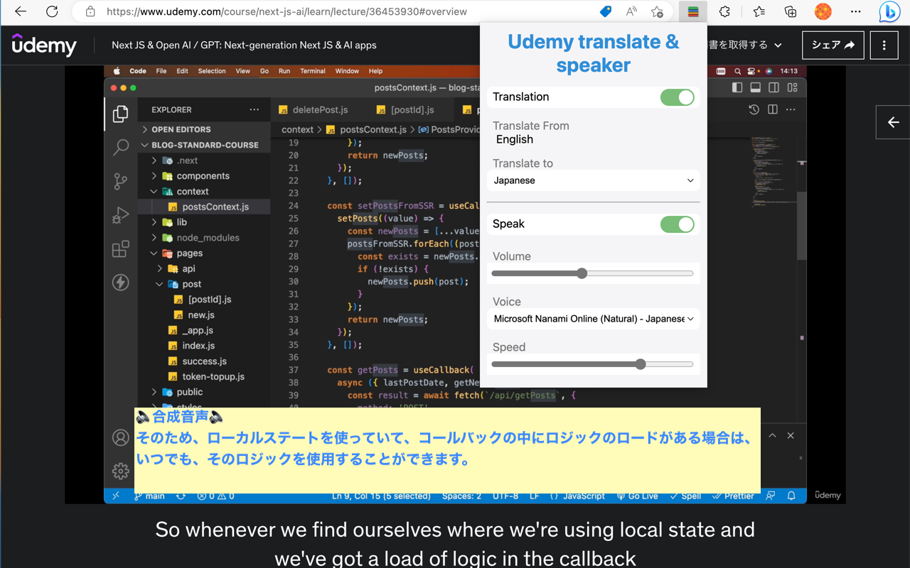

# Udemy Translate Speech & Chrome Extension

The Udemy Translate Speech Chrome Extension is a tool that automatically translates the subtitles of Udemy learning videos and plays them back in synthesized speech. This extension can help users who are learning a new language to easily understand the video content and follow along with the subtitles.

## Features

- Automatic translation of Udemy video subtitles to the user's preferred language
- Playback of the translated subtitles using synthesized speech
- Customizable settings for language preferences and voice options

## Getting Started

To use this extension, simply install it from the Chrome Web Store and open a Udemy learning video. The extension will automatically detect the video's subtitles and offer to translate them. Once the subtitles have been translated, the user can choose to play them back in synthesized speech.

## Requirements

This extension requires the Google Chrome browser to be installed on the user's computer.

## Contributions

Contributions to this project are welcome. Please see the [Contributing Guidelines](CONTRIBUTING.md) for more information.

## License

This project is licensed under the [MIT License](LICENSE).
